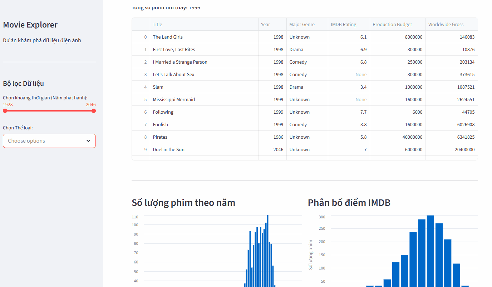

# 🎬 Interactive Movie Analytics Dashboard

[](https://film-explorer-datpq.streamlit.app/)


<p align="center">
  
</p>

## 📌 Tổng quan dự án (Overview)
Đây là một ứng dụng Web tương tác (Interactive Web App) được xây dựng bằng Python và Streamlit. Ứng dụng cho phép người dùng khám phá, lọc và phân tích trực quan dữ liệu của 1999 bộ phim điện ảnh dựa trên doanh thu, kinh phí sản xuất, điểm số IMDB và thể loại. 

Dự án được thiết kế theo chuẩn **Lập trình hướng đối tượng (OOP)**, giúp tối ưu hóa hiệu suất xử lý dữ liệu và dễ dàng mở rộng tính năng trong tương lai.

## ✨ Tính năng nổi bật (Key Features)
* **Xử lý dữ liệu động:** Tự động làm sạch dữ liệu (Data Cleaning), xử lý giá trị khuyết thiếu (NaN) và ép kiểu dữ liệu tài chính bằng thư viện `Pandas`.
* **Lọc đa chiều:** Giao diện Sidebar cho phép lọc phim theo khoảng thời gian (Năm phát hành) và Thể loại một cách mượt mà.
* **Trực quan hóa tương tác (Interactive Data Viz):** Sử dụng `Altair` để vẽ các biểu đồ:
  * Biểu đồ phân bố số lượng phim theo năm.
  * Histogram phân bố điểm số IMDB.
  * Biểu đồ Scatter Plot phân tích tương quan giữa Kinh phí sản xuất và Doanh thu toàn cầu.

## 🛠 Công nghệ sử dụng (Tech Stack)
* **Ngôn ngữ:** Python 3.x
* **Xử lý dữ liệu:** Pandas, NumPy
* **Trực quan hóa:** Altair
* **Web Framework & Deployment:** Streamlit (Community Cloud)

## 🏗 Cấu trúc mã nguồn (Project Structure)
Dự án áp dụng thiết kế OOP với các lớp (Class) được phân tách rõ ràng:
* `DataLoader`: Chịu trách nhiệm đọc file `movies.csv`, chuẩn hóa chuỗi thời gian (Datetime) và dọn dẹp dữ liệu lỗi. Được tối ưu hóa bằng `@st.cache_data` để tăng tốc độ load.
* `ChartDrawer`: Chuyên trách khởi tạo và render các biểu đồ Altair/Streamlit.
* `main()`: Hàm điều khiển luồng chính và xây dựng giao diện người dùng (UI).

## 🚀 Hướng dẫn cài đặt (Chạy trên máy cá nhân)
Nếu bạn muốn chạy dự án này trên máy tính của mình (Localhost), hãy làm theo các bước sau:

1. Clone kho lưu trữ này về máy:
   ```bash
   git clone https://github.com/datpq-alpha/film-explorer.git
